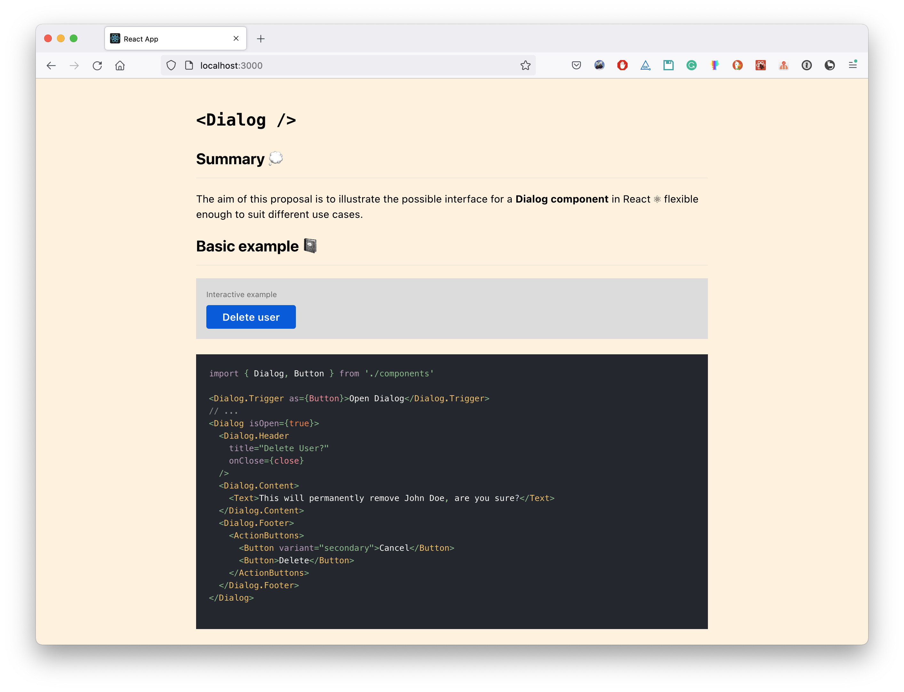
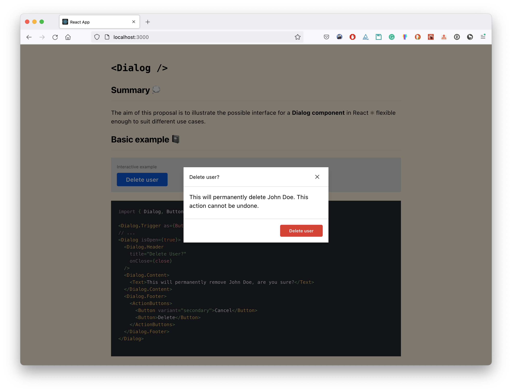
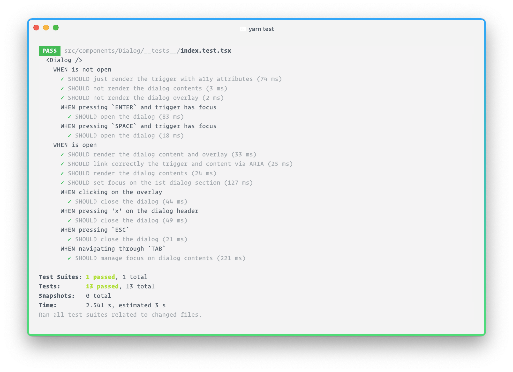

# Dialog RFC



A proposal for a flexible and accessible **Dialog component**. You can preview [the RFC here](https://dialog-rfc.vercel.app/) and play with the **interactive examples** which are integrated on it.



## Running locally 🔖

Alternatively you can run the application locally.

Before you start, you will need:

- [Git](http://git-scm.com/book/en/v2/Getting-Started-Installing-Git)
- [Node.js](https://nodejs.org/download/)
- [Yarn Package Manager](https://yarnpkg.com/en/)

Once ready, install all the dependencies:

```
$ yarn
```

And run both the API and Development server:

```bash
$ yarn start
```

From there, you can open the app by visiting [`localhost:3000`](http://localhost:3000/) on your browser.

You can run the components tests like so:



```bash
$ yarn test
```

Refer to the [CRA docs](https://create-react-app.dev/docs/troubleshooting/) if you hit any issues.

## Stack 🧱

- [Typescript](https://www.typescriptlang.org/)
- [Styled Components](https://styled-components.com/)
- [CRA](https://create-react-app.dev/)
- [MDX](https://mdxjs.com/)
- [Reakit#Tabbable](https://reakit.io/docs/tabbable/#main)
