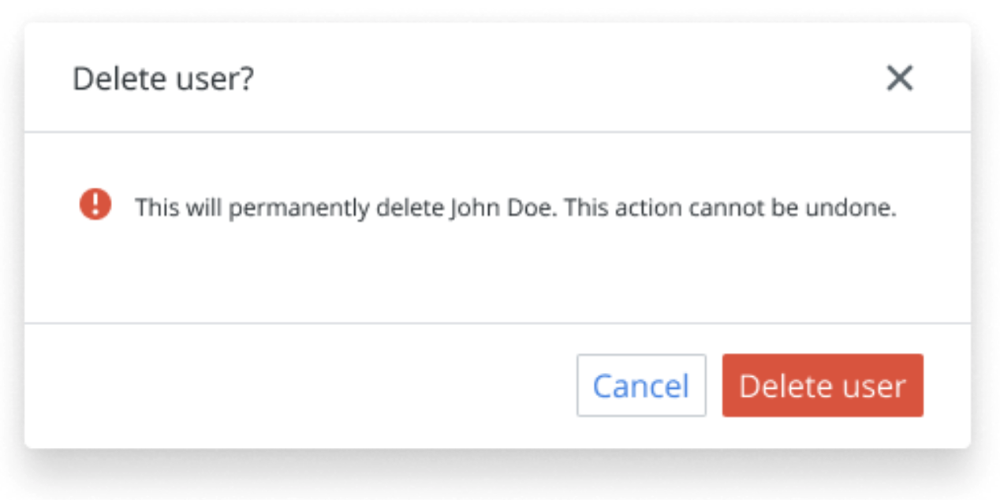

- **Start Date**: 2021-04-07

## Summary 💭

This illustrates the possible interface for a **Dialog component** in React that can be customized for different use cases.

## Basic example 📓



```tsx
<Dialog.Trigger as={Button}>Open Dialog</Dialog.Trigger>
// ...
<Dialog isOpen={true}>
  <Dialog.Header
    title="Delete User?"
    onClose={close}
  />
  <Dialog.Content>
    <Text>This will permanently delete John Doe, are you sure?</Text>
  </Dialog.Content>
  <Dialog.Footer>
    <ActionButtons>
      <Button variant="secondary">Cancel</Button>
      <Button>Delete</Button>
    </ActionButtons>
  </Dialog.Footer>
</Dialog>
```

## Motivation ☕️

The idea is to have a `<Dialog />` component that can be customized to server different use cases.

Any content can be served within the dialog, on top of that, the title can be customized as well as whether the close `X` option.

Both the **header** and the **footer** can be optionally rendered.

The contents of the **footer** can be customized as well.

The idea is that this dialog is flexible enough to suit different use-cases like:


- _editing a document_
- _warning before applying some changes_
- _contacting support_
- _deleting an entity_

## Detailed design 📐

This new Dialog component should be:

- **uncontrolled component**
  - _open/close state will need to be managed outside of the component_
- **agnostic on child structure**
  - _leveraging [dot notation](https://reactjs.org/docs/jsx-in-depth.html#using-dot-notation-for-jsx-type) to let consumers decide what to render_
- **agnostic on trigger component**
  - _we should not assume any shape/type for the dialog trigger_
- **accessible**
  - _making sure it adheres [to WAI-ARIA](https://www.w3.org/TR/wai-aria-practices/#dialog_modal) as much as possible_
- **portal first**
  - _leveraging [React Portals](https://reactjs.org/docs/portals.html) the dialog will mount at the root of the `<body>` in the HTML, no matter where it's rendered in the React tree to prevent issues with overlays and `z-index`_

### Acceptance criteria

The dialog should be able to be open from any interaction with another React component ⚛ ( like a `click` event ) or programmatically according as a side-effect of some other logic.

The dialog should be able to be closed from any interaction with another React component ⚛ within it ( like after a click on a button on its footer ).

When the dialog is open, clicking outside of it should close the dialog.

The dialog should render vertically/horizontally centered within the viewport on a wide screen. On a narrow screen, it should take all the available space within the viewport.

### Elaborate example 📓

```tsx
function PageWithDialog() {
  const [isOpen, toggleOpen] = React.useState(false);
  const toggleDialog = () => toggleOpen((s) => !s);

  return (
    <>
      <Dialog.Trigger as={Button} onClick={toggleDialog}>
        Open Dialog
      </Dialog.Trigger>
      <Dialog isOpen={isOpen}>
        <Dialog.Header onClose={toggleDialog}>Edit datastream</Dialog.Header>
        <Dialog.Content>
          <Image src={googleAdsImg} alt="Google Ads logo" />
          <Form>
            <Label for="title" />
            <TextInput id="title" value="Google Ads report" />
            <Label for="description" />
            <TextInput id="description" value="" />
          </Form>
        </Dialog.Content>
        <Dialog.Footer>
          <div>
            <a href="path/to/foo">Copy link</a>
            <a href="path/to/bar">Get embed code</a>
          </div>
          <ButtonGroup>
            <Button variant="secondary">Cancel</Button>
            <Button>Apply</Button>
          </ButtonGroup>
        </Dialog.Footer>
      </Dialog>
    </>
  );
}
```

## Drawbacks 👻

Why should we _not_ do this? Please consider:

- implementation cost, both in term of code size and complexity
- whether the proposed feature can be implemented in user space
- the impact on teaching people React
- integration of this feature with other existing and planned features
- cost of migrating existing React applications (is it a breaking change?)

Implementing a fully accessible and customizable `<Dialog />` component is not an easy task. Instead of writing our own and having to maintain the logic we could built on top of [Reakit#Dialog](https://reakit.io/docs/dialog/) or [ReactUI#Dialog](https://reach.tech/dialog/) which are un-opinionated on styling but would take away the burden of ensuring accessibility from us.

## Alternatives ⤴

As mentioned, we can use [Reakit#Dialog](https://reakit.io/docs/dialog/) or [ReactUI#Dialog](https://reach.tech/dialog/) and apply our own styling, just wrapping them in our library. However, this approach would make us force to sync major releases of our library with theirs when applying updates.

## Adoption strategy ⚙️

Adoption strategy should be pretty straightforward and users should be able to use it straightaway without conflicting with usage of other dialog components.

We could hire an accessibility expert to QA our implementation to make sure it's easy to navigate with assistive technology despite our tests.

## How we teach this 🧵

This repository shows examples of using this component in isolation with all its possible variations. Please refer to the `README` to run the documentation. The tests as well should document as well how to use the component. We can pair-program with users of this component when they try to implement it and gather feedback on its API and behavior.

## Unresolved questions ❓

None for now.
